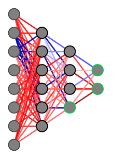

# network-observability
Evaluate the observability of artificial neural network weights and biases from arbitrary measured neurons. Also has code to visualize feedforward network structures in FCNN style.

This repo relies heavily on my other project for empirical observability:
https://github.com/vanbreugel-lab/pybounds

# Examples
Start here for a basic example on a PyTorch  model.
[network_observability_example.ipynb](notebooks%2Fnetwork_observability_example.ipynb)

This example creates a simple feedforward PyTorch model with linear output functions and randomized weights (not trained for a specific purpose). Then, it uses random sets of inputs to construct an observability matrix given measurements from specified neurons (output or hidden layer neurons). Rhe Fisher information + inverse is computed and used to assess the observability of each network weight/bias. The network is visualized such that the measured neurons are indicated (green) and the connections are colored by their observability level (red equals more observable, blue less observable).

Also see more in depth visualization examples:
[network_visualization_example.ipynb](notebooks%2Fnetwork_visualization_example.ipynb)

